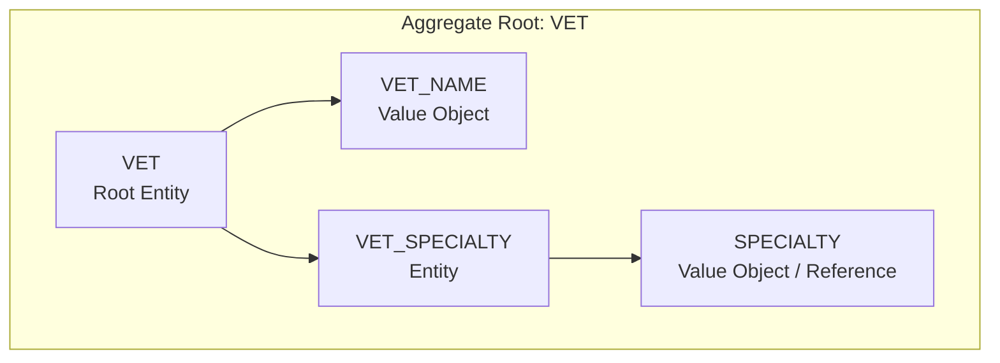
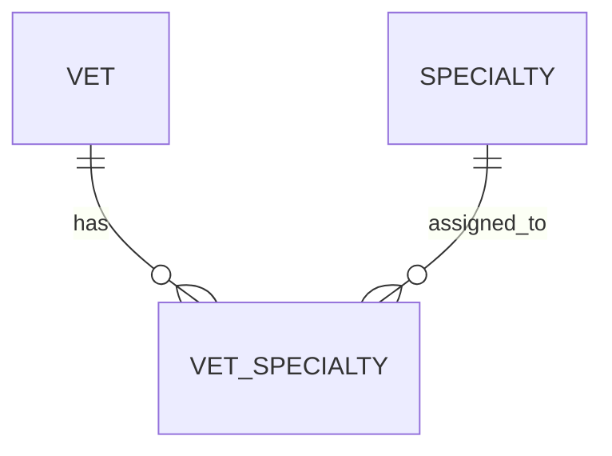

# Vet Catalog Capability Entity Model

The `vet-catalog` Software Capability owns the `VET` aggregate model used by the `veterinary-directory` Software Activity.
Specialties are loaded as part of the displayed veterinarian profile.

## Aggregate Boundary Diagram

## Entity Relationship Diagram

### VET

| Attribute | Description | Data Type | Validation Rules |
|-----------|-------------|-----------|------------------|
| id | Unique identifier | Integer | Primary Key |
| first_name | Vet's first name | String | Not Null |
| last_name | Vet's last name | String | Not Null |

### SPECIALTY

| Attribute | Description | Data Type | Validation Rules |
|-----------|-------------|-----------|------------------|
| id | Unique identifier | Integer | Primary Key |
| name | Display name | String | Not Null, Unique |

### VET_SPECIALTY

| Attribute | Description | Data Type | Validation Rules |
|-----------|-------------|-----------|------------------|
| vet_id | Veterinarian reference | Integer | Foreign Key |
| specialty_id | Specialty reference | Integer | Foreign Key |

**Constraints:** The combination of `vet_id` and `specialty_id` is unique.

## Aggregate Insight

`view-veterinarians` is a read use case over the `VET` aggregate projection. No synthetic use-case aggregate is needed.
