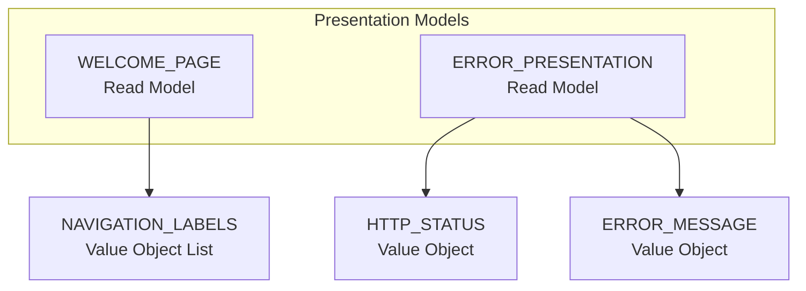

# Clinic Portal Capability Entity Model

This Business Capability has no persistent business aggregate. It owns presentation read models for the welcome page and
application error handling.

## Aggregate Boundary Diagram

### WELCOME_PAGE

| Attribute | Description | Data Type | Validation Rules |
|-----------|-------------|-----------|------------------|
| decorative_image_path | Image rendered on the welcome page | String | Not blank |
| navigation_labels | Main navigation entries exposed to visitors | List<String> | Includes Home, Find Owners, Veterinarians, Error |

### ERROR_PRESENTATION

| Attribute | Description | Data Type | Validation Rules |
|-----------|-------------|-----------|------------------|
| heading | User-facing error heading | String | Always `Something happened...` |
| message | Exception message or custom router message | String | Message only; no stack trace |
| http_status | Router status code | Integer | 404 for not found, 500 for unexpected errors |

## Aggregate Insight

`view-welcome-page` and `view-application-error` are read/presentation use cases. They should not force synthetic
aggregate roots or dedicated persistence tables.
