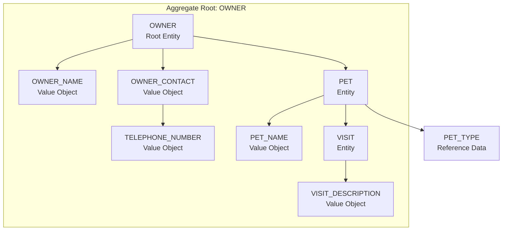
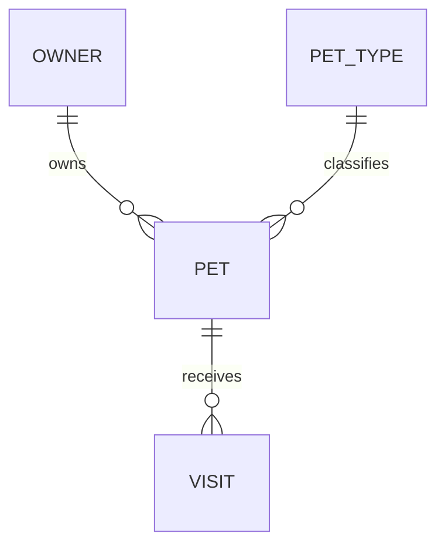

# Owner Management Entity Model

The natural aggregate root emerging from the owner, pet, and visit use cases is `OWNER`. The important invariants are
owner-scoped: pet names are unique per owner, and visits can only be booked for pets belonging to the selected owner.

## Aggregate Boundary Diagram

## Entity Relationship Diagram

### OWNER

| Attribute | Description | Data Type | Validation Rules |
|-----------|-------------|-----------|------------------|
| id | Unique identifier | Integer | Primary Key, Sequence |
| first_name | Owner's first name | String | Not Null |
| last_name | Owner's last name | String | Not Null |
| address | Street address | String | Not Null |
| city | City of residence | String | Not Null |
| telephone | Contact phone number | String | Not Null, Format: `\d{10}` |

### PET

| Attribute | Description | Data Type | Validation Rules |
|-----------|-------------|-----------|------------------|
| id | Unique identifier | Integer | Primary Key, Sequence |
| name | Pet name | String | Not Null, unique per owner case-insensitively |
| birth_date | Date of birth | Date | Required by forms, not in the future |
| type_id | Pet type reference | Integer | Required |
| owner_id | Owning owner reference | Integer | Foreign Key |

### VISIT

| Attribute | Description | Data Type | Validation Rules |
|-----------|-------------|-----------|------------------|
| id | Unique identifier | Integer | Primary Key, Sequence |
| visit_date | Visit date | Date | Not Null |
| description | Reason for the appointment | String | Not blank |
| pet_id | Pet reference | Integer | Foreign Key |

### OWNER_LISTING

Read model used by `find-owners-by-last-name`.

| Attribute | Description | Data Type | Validation Rules |
|-----------|-------------|-----------|------------------|
| owner | Owner contact data | OWNER | Not Null |
| pet_names | Alphabetical pet names for display | List<String> | May be empty |

### OWNER_DETAILS

Read model used by `view-owner-details`.

| Attribute | Description | Data Type | Validation Rules |
|-----------|-------------|-----------|------------------|
| owner | Owner contact data | OWNER | Not Null |
| pets | Pets with chronological visit histories | List<PET_DETAILS> | Alphabetical by pet name |

## Aggregate Insight

`register-new-owner` and `update-owner` mutate the `OWNER` root directly. `find-owners-by-last-name` and
`view-owner-details` are read use cases over owner projections.
