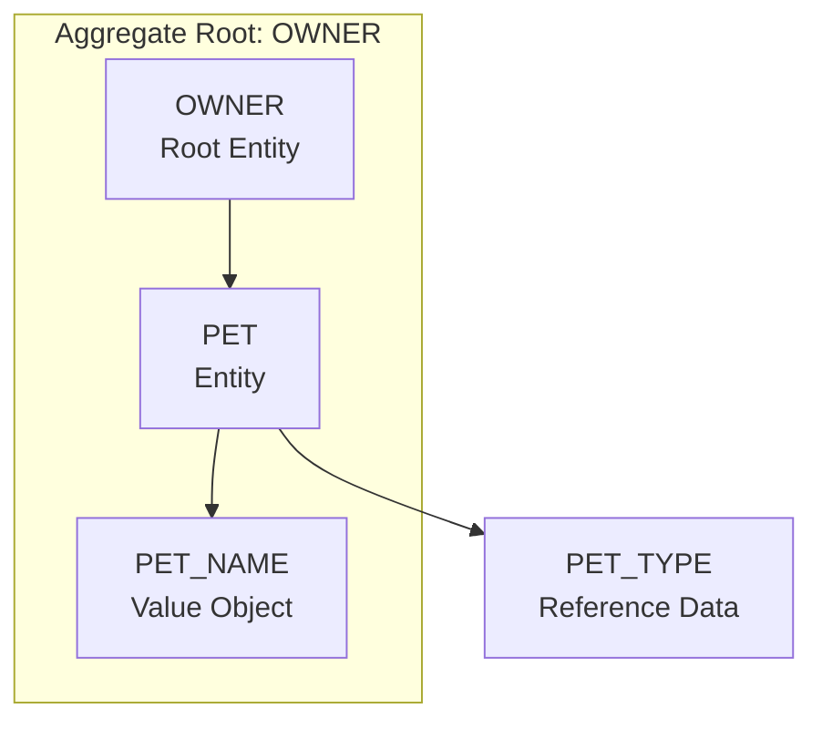
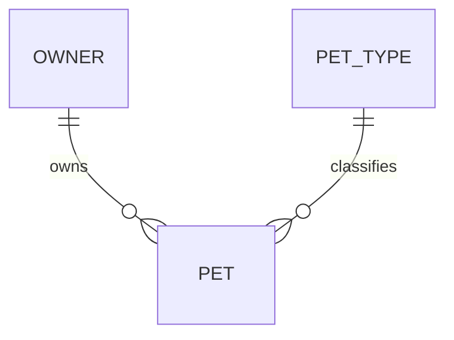

# Pet Management Entity Model

The pet-management use cases point back to the `OWNER` aggregate: pet-name uniqueness is scoped to the owner, and pet
commands are only valid inside an owner context.

## Aggregate Boundary Diagram

## Entity Relationship Diagram

### PET

| Attribute | Description | Data Type | Validation Rules |
|-----------|-------------|-----------|------------------|
| id | Unique identifier | Integer | Primary Key, Sequence |
| name | Pet name | String | Not Null, unique per owner case-insensitively |
| birth_date | Date of birth | Date | Required by forms, not in the future |
| type_id | Pet type reference | Integer | Required |
| owner_id | Owning owner reference | Integer | Foreign Key |

### PET_TYPE

Reference data defining species or category.

| Attribute | Description | Data Type | Validation Rules |
|-----------|-------------|-----------|------------------|
| id | Unique identifier | Integer | Primary Key |
| name | Display name | String | Not Null, Unique |

## Aggregate Insight

`add-pet-to-owner` and `update-pet` should use `OWNER` as the primary consistency boundary. The current code still keeps
`PetRepository` as a persistence port for implementation pragmatism, but the domain rule belongs to the owner-scoped
pet collection.
