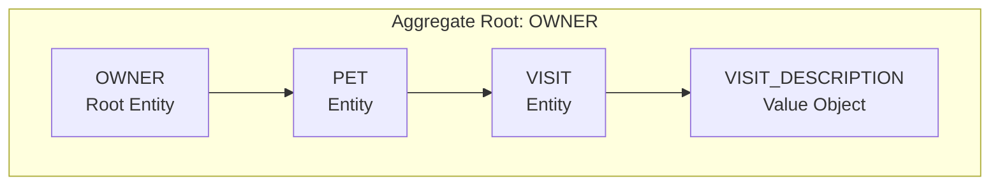
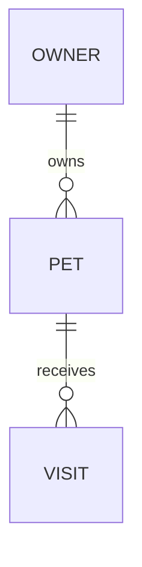

# Visit Management Entity Model

The booking use case is owner-scoped: a visit can only be prepared and booked through the owner that owns the pet.

## Aggregate Boundary Diagram

## Entity Relationship Diagram

### VISIT

| Attribute | Description | Data Type | Validation Rules |
|-----------|-------------|-----------|------------------|
| id | Unique identifier | Integer | Primary Key, Sequence |
| visit_date | Visit date | Date | Not Null, defaults to today in the UI |
| description | Reason for the appointment | String | Not blank |
| pet_id | Pet reference | Integer | Foreign Key |

**Consistency rule:** A visit can only be booked through the owner that owns the pet.

## Aggregate Insight

`book-visit-for-pet` should use `OWNER` as the primary consistency boundary because ownership of the target pet is the
gatekeeper rule. The visit row is append-only persistence for an entity inside that owner-scoped lifecycle.
